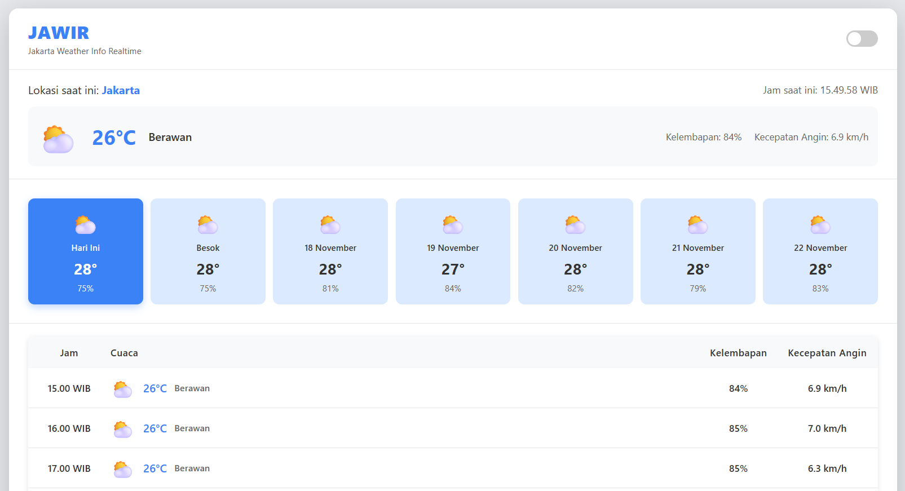

# JAWIR

## Jakarta Weather Info Realtime

JAWIR merupakan program yang menampilkan informasi cuaca Jakarta secara **real-time** menggunakan data dari API Open-Meteo. Program ini dirancang agar ringan, cepat, dan mudah dipahami oleh pengguna.

---

## 🔥 Fitur Utama

* Prakiraan cuaca real-time untuk wilayah Jakarta
* Informasi lengkap: suhu, kondisi cuaca, kelembapan, kecepatan angin
* Prakiraan harian untuk beberapa hari ke depan
* Tampilan jam saat ini (WIB)
* UI ringkas dan responsif
* **Dukungan Dark Mode** untuk kenyamanan penggunaan

---

## 📸 Preview



---

## 📡 Sumber Data API

Aplikasi ini menggunakan API dari **Open-Meteo**:

```
https://api.open-meteo.com/v1/forecast?
  latitude=-6.2&
  longitude=106.8&
  hourly=temperature_2m,relativehumidity_2m,windspeed_10m,weathercode
```

---

## 🚀 Cara Menjalankan

1. Clone repository:

   ```bash
   git clone https://github.com/syarhida/jawir.git
   ```
2. Masuk ke folder proyek:

   ```bash
   cd jawir
   ```
3. Buka file `index.html` di browser atau jalankan dengan Live Server.

---

## 🛠️ Teknologi yang Digunakan

* HTML, CSS, JavaScript
* Open-Meteo API

---

## 📄 Lisensi

Proyek ini dirilis menggunakan lisensi **MIT**.

---

## 💬 Kontribusi

Silakan buat *issue* atau *pull request* jika ingin menambahkan fitur atau memperbaiki bug.

---

## ✨ Dibuat oleh

* **Syarif Hidayat** - **045294181**

Program ini dibuat sebagai **Tugas 2 Mata Kuliah Pemrograman Berbasis Perangkat Bergerak** dari **Universitas Terbuka**.